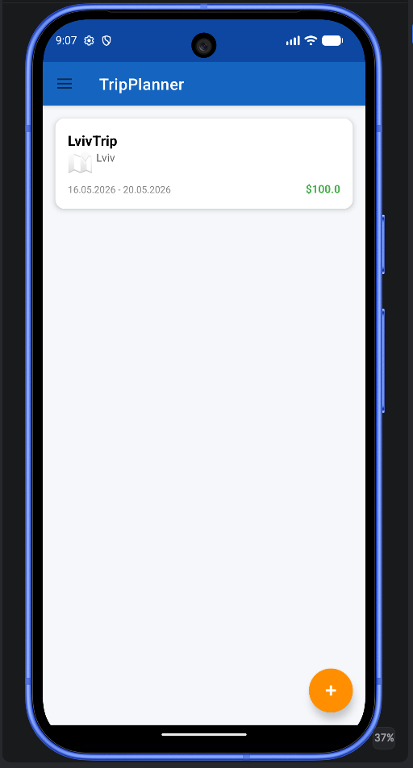
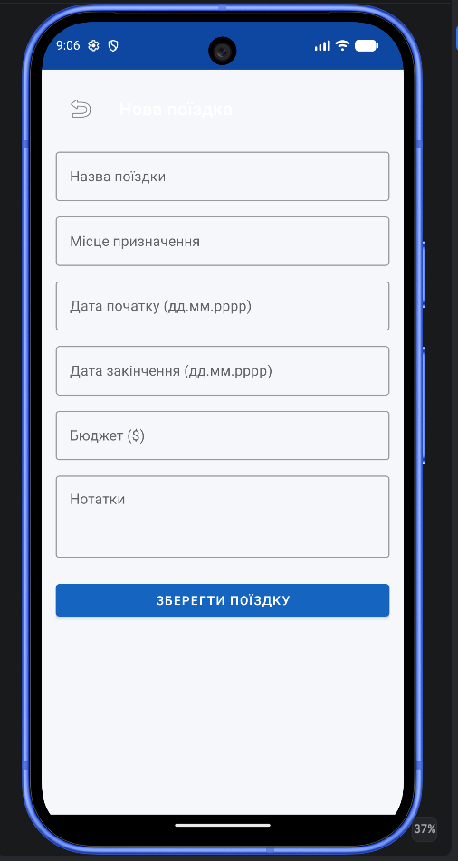
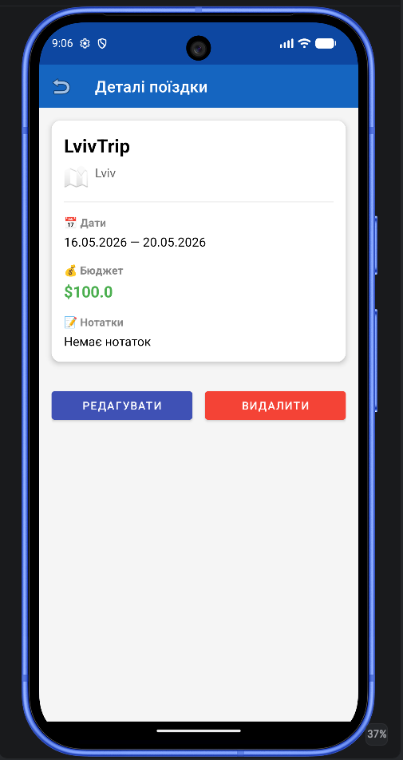
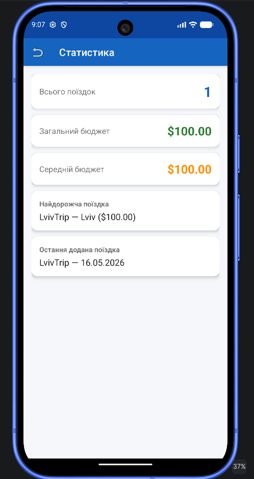
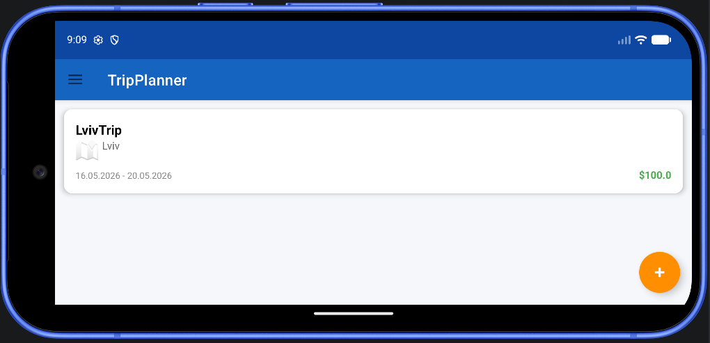

# TripPlanner

Android application for planning and managing trips, built with Kotlin and MVVM architecture.

## Features

- Create new trips
- Edit and delete trips
- View trip details
- Track travel budgets
- Statistics screen
- Navigation Drawer navigation
- Local offline storage with Room Database
- Responsive UI with landscape support

## Tech Stack

- Kotlin
- Android SDK
- Room Database
- SQLite
- MVVM
- ViewModel + LiveData
- Kotlin Coroutines
- Material Design Components
- RecyclerView

---

## Screenshots

### Empty State

### Main Screen

### Add Trip Screen

### Trip Details

### Statistics Screen

### Landscape Orientation Support

---

## Architecture

The application follows the MVVM architecture pattern:

- **Model** — Room entities, DAO, Repository
- **View** — Activities and XML layouts
- **ViewModel** — UI state management and business logic

---

## Implemented Functionality

- CRUD operations for trips
- RecyclerView list rendering
- LiveData observation
- Room persistence layer
- Navigation Drawer
- Form validation
- Statistics calculations
- Empty state handling
- Adaptive layouts

---
